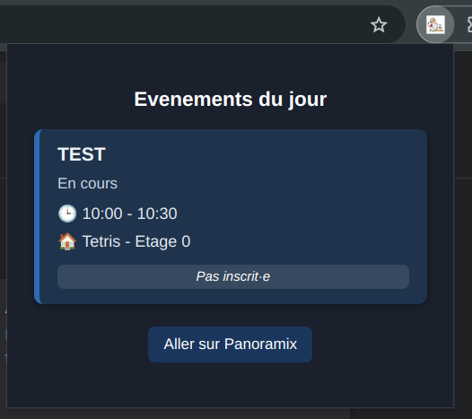

# panoramix_of_the_day

The Chrome extension **Panoramix Day** is a simple but practical tool that let you see all the events on [Panoramix](hhtps://panoramix.epitest.eu) Epitech Master of Science calendar for today !

  
  
  

## 💾 Installation Guide

Download the latest release in the [releases section](https://github.com/AntoineKoiko/Panoramix_day/releases) or clone the repo.

Steps to install the extension:
- Go to chrome extensions tab (open chrome://extensions/)
- Enable developer mode (top right corner)
- Unzip the extension folder
- Click on "Load unpacked" and select the `app` directory in the unzipped folder

See Google Chrome tutorial [here](https://developer.chrome.com/docs/extensions/get-started/tutorial/hello-world#load-unpacked)

## 📝 Contributing

If you would like to contribute to the development of this extension or report issues, please open an issue on the GitHub repository or create a pull request.

If you have any questions or encounter issues with the extension, feel free to contact us via the GitHub repository.
